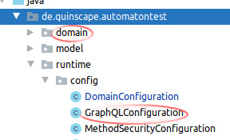

# Automaton-Tooling

Java-based command-line generation helpers for Automaton.

This project generates an multi-command "uber jar" which contains all necessary dependencies.

## Usage

```shell script 
java -jar automaton-tooling-1.0-SNAPSHOT.jar -b my.package -i <JSON-input-path> -o <java-output-path>
```

The `--base-package`/`-b` option defines the base package name of the automaton application to generate the 
GraphQLConfiguration for. The tool assumes a standard automaton project layout.




It is assumed that the `domain` package contains the generared JOOQ sources.

The output is supposed to be written to `runtime.config.GraphQLConfiguration` and the output file should match that.
 

## Configuration

### Command `graphql`  

Our first command is `graphql` which is used to generate a automaton GraphQLConfiguration.java file based on a JSON 
configuration.

The classes in de.quinscape.automaton.tooling.model.graphql act as a schema for our JSON configuration.

### GraphQLConfig

Root node for our JSON data

name | type | description 
-----|------|-------------
nameFieldsByType | Map of List&lt;String&gt; | Type specific name field configuration. Maps the name of a POJO type to a list of name fields for that type. The given type will use the given name fields as representative values/name field.
nameFields | List of String | Default name fields. The first name in the list contained in a type is used as name field for that type.
foreignKeyRelations | List of [ForeignKeyRelation](docs/reference.md#foreignkeyrelation) | List of foreign key based relation configurations.
additionalInputTypes | List of String | List of additional POJO names to use as input types.
viewRelations | List of [ViewRelation](docs/reference.md#viewrelation) | List of view / POJO based relation configurations.
## Graphql Config Example

```json
{
    "additionalInputTypes": [
        "Foo",
        "Bar"
    ],
    "foreignKeyRelations": [
        {
            "fkField" : "FOO.OWNER_ID",
            "sourceField" : "OBJECT_AND_SCALAR",
            "targetField" : "MANY"
        },
        {
            "fkField" : "QUX_MAIN.QUX_B_NAME",
            "sourceField" : "OBJECT_AND_SCALAR",
            "leftSideObjectName": "quxB"
        }

    ],
    "viewRelations": [
        {
            "sourcePojo" :  "IBearbeiteteObjekteAnlagenBetriebsstaetten",
            "sourceFields" : ["beaAnlageId"],
            "targetPojo" :  "AAnlage",
            "targetFields" : ["id"],
            "sourceField" :  "OBJECT_AND_SCALAR",
            "leftSideObjectName" :  "aAnlage"
        },
        {
            "sourcePojo" :  "IFavoritenAnlagenBetriebsstaetten",
            "sourceFields" : ["favAnlageId"],
            "targetPojo" :  "AAnlage",
            "targetFields" : ["id"],
            "sourceField" :  "OBJECT_AND_SCALAR",
            "leftSideObjectName" :  "aAnlage",
            "targetField" :  "MANY",
            "rightSideObjectName" :  "anlagen"
        }

    ],
    "nameFields": ["name"],
    "nameFieldsByType": {
        "Bar" : ["name", "description"],
        "Qux" : ["asName"]
    }
}

```
## Links

 * [JSON reference](./docs/reference.md)
 * [Current "uber-jar" download](./target/automaton-tooling-1.0-SNAPSHOT-uber.jar)
